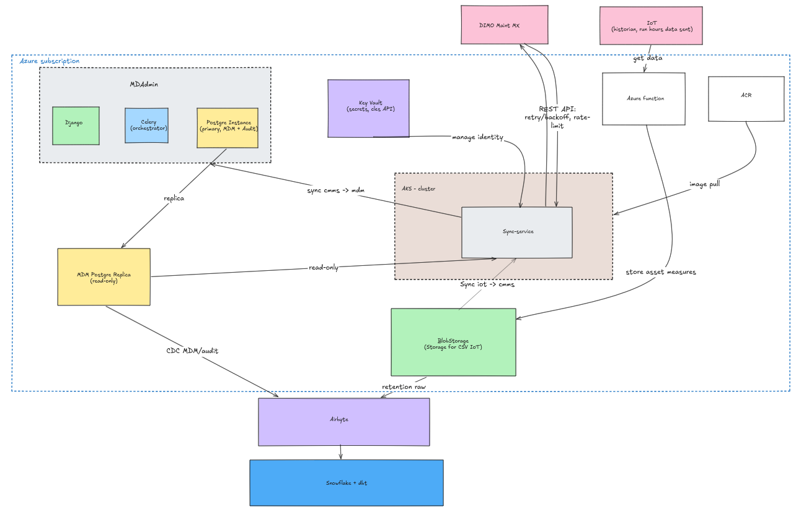
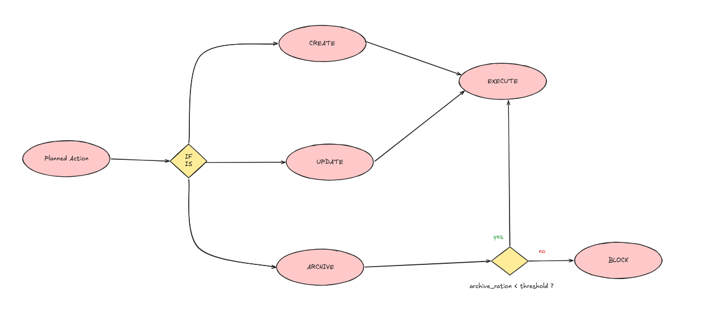
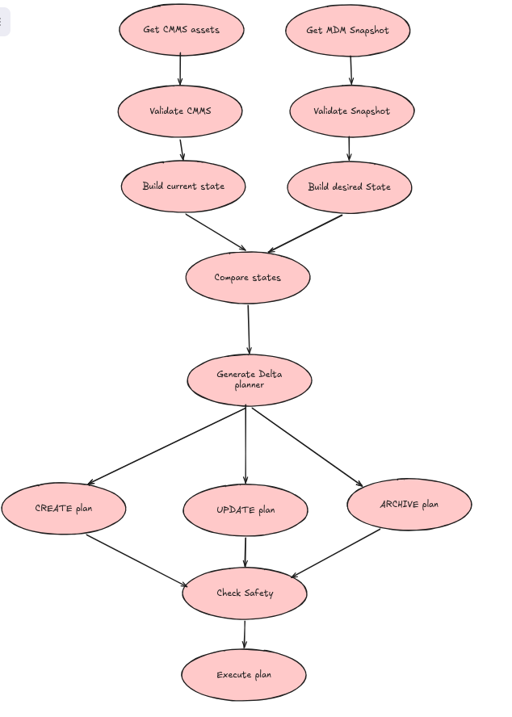
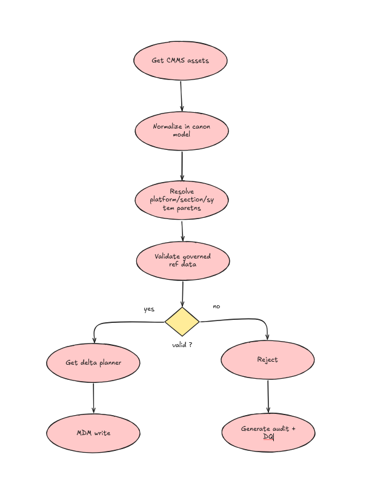
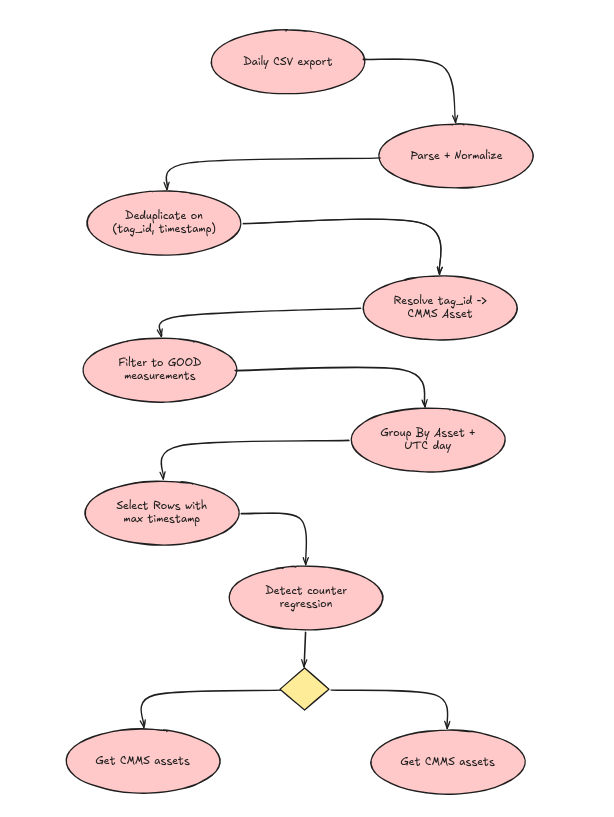

# Part A — Target Architecture

## 1. Objective and design principles

The goal is to maintain a coherent operational asset hierarchy between the MDM and the CMMS, while feeding CMMS running-hour meters from the IoT historian.

The three integrations have explicit data ownership:

- **MDM → CMMS:** MDM is the source of truth for sites, platforms and sections.
- **CMMS → MDM:** CMMS is the source of truth for systems and equipments.
- **IoT → CMMS:** the historian is the source of truth for cumulative running hours.

The design is based on eight principles:

1. **Ownership-driven synchronization:** only the owning system can authoritatively change a mastered attribute.
2. **Desired-state reconciliation:** compute a delta before issuing any write; unchanged entities produce `NOOP`. ([`pipeline/pipeline/canonical.py::compute_plan()`](pipeline/pipeline/canonical.py#L84), [`pipeline/pipeline/cmms_to_mdm.py`](pipeline/pipeline/cmms_to_mdm.py)'s `changed` diff.)
3. **Idempotent writes:** a replay of the same run is safe and produces no additional writes. ([`pipeline/pipeline/audit.py::AuditStore`](pipeline/pipeline/audit.py#L118) -- see section 6.)
4. **Safety before execution:** destructive actions are planned first and executed only after guardrails pass. ([`canonical.py::compute_plan()`](pipeline/pipeline/canonical.py#L84)'s two safety-rail passes -- see section 3.)
5. **Isolation of failures:** a bad entity or transient API failure must not invalidate unrelated work. (`failed_parents` propagation in [`mdm_to_cmms.py`](pipeline/pipeline/mdm_to_cmms.py)/[`cmms_to_mdm.py`](pipeline/pipeline/cmms_to_mdm.py)'s per-item `try/except`.)
6. **Full auditability:** every write is associated with a `run_id` and a business outcome. ([`pipeline/pipeline/audit.py`](pipeline/pipeline/audit.py) schema.)
7. **Explicit data-quality outcomes:** invalid parentage, unknown reference data and unresolved IoT assets are rejected/quarantined rather than silently repaired. ([`cmms_to_mdm.py::_reject()`](pipeline/pipeline/cmms_to_mdm.py#L281), [`pipeline/pipeline/iot.py::resolve_tag()`](pipeline/pipeline/iot.py#L95).)
8. **No fabricated industrial measurements:** missing or suspicious historian data is surfaced as a data-quality issue instead of being inferred. ([`pipeline/pipeline/iot_to_cmms.py::run()`](pipeline/pipeline/iot_to_cmms.py#L35)'s counter-regression and no-GOOD-reading branches.)

---

## 2. Target production architecture



### Why Celery, not a new orchestrator

Confirmed on the clarification call: Celery already runs in production today on the MDAdmin/Django instance itself ([`docs/01_context.md`](docs/01_context.md#L35) describes its one existing five-step chain there). It is live infrastructure, not something this design would introduce. Repointing it at three new, independent tasks is additive to what already runs; bringing in a second "how do we schedule background work" mechanism (Airflow) purely for this integration would not be, and nothing about these three tasks needs a DAG tool: they have no ordering dependency on each other (each owns a disjoint slice of state -- platforms/sections, systems/equipments, meters), unlike the old chain's five sequential steps, so a Celery `group` replaces it directly:

```text
nightly_sync (Celery group, triggered by Beat)
├── mdm_to_cmms_task    → pipeline.mdm_to_cmms.run()
├── cmms_to_mdm_task    → pipeline.cmms_to_mdm.run()
└── iot_to_cmms_task    → pipeline.iot_to_cmms.run()
```

Celery is responsible for **when and in which order** work runs, not for API retry/rate-limit logic -- that stays in the sync service's own client layer, as it already does in the `pipeline/` prototype ([`clients/cmms.py::CmmsClient`](pipeline/pipeline/clients/cmms.py#L85)). The one thing this repointed setup still owes the CMMS is what section 7 already requires: its rate budget has to be respected across the whole run, not per task in isolation -- a single concurrency-limited queue for the CMMS-calling tasks is enough for that, since it's one instance rather than a worker fleet.

### Alternative: Azure Container Apps Jobs

Whether Celery serves anything beyond this one legacy chain in MDAdmin is still unconfirmed ([`DECISIONS.md`](DECISIONS.md#L15)). If it turns out to serve nothing else, and Perenco would rather retire it from MDAdmin than keep it running for three nightly tasks, **Azure Container Apps Jobs on a cron trigger** is the alternative: no broker, worker or Beat process to operate at all, native per-job retry, execution history through Azure Monitor. The cost is no native cross-task dependency graph if requirements ever grow past three independent branches, and a "job never fired at all" failure mode that needs its own dead-man's-switch alert, where a DAG-oriented tool would surface a missing run more passively. Since Celery is already running rather than something to newly provision, choosing this alternative would be a deliberate decommissioning decision, not a technical necessity created by this integration.

---

## 3. Integration 1 — MDM → CMMS

### Active-scope rule

An MDM object is active when `date_start <= now()` and `date_end` is null or `> now()`, applying one consistent timezone across all entities. Implemented once, centrally, as [`pipeline/pipeline/timeutil.py::is_active()`](pipeline/pipeline/timeutil.py#L32) -- every CREATE/ARCHIVE decision in this integration goes through it rather than re-deriving the comparison at each call site; boundary-tested in [`pipeline/tests/test_timeutil.py`](pipeline/tests/test_timeutil.py) (starts-today / ends-today / ends-tomorrow, both inclusive/exclusive edges).

### Destructive-action policy

The 10% archive threshold is a **hard stop for destructive actions only**. Therefore a run may continue with non-destructive CREATE/UPDATE operations while ARCHIVE operations are blocked when the threshold is exceeded.



Implemented today as a **single, global scope**: [`pipeline/pipeline/canonical.py::compute_plan()`](pipeline/pipeline/canonical.py#L84) computes one ratio (archive candidates still eligible after the descendant check, divided by the whole active PLATFORM/SECTION tree) and blocks the ARCHIVE subset if it exceeds the threshold; non-destructive work is unaffected either way. Tested in [`pipeline/tests/test_canonical.py::test_archive_ratio_threshold_blocks_destructive_but_not_constructive_work`](pipeline/tests/test_canonical.py#L90), and fires for real against the sandbox seed data: 21.7% vs. a 10% default, every archive blocked on the first run.

A **per-body/site scope in addition to the global one** is a target refinement I would still want before production, not something built here: a single large but legitimate site closure could exceed 10% of the whole tenant while being entirely valid, while data corruption confined to one small body could stay under a global 10% and still be wrong for that body specifically. [`DesiredNode`](pipeline/pipeline/canonical.py#L22)/[`CurrentAsset`](pipeline/pipeline/canonical.py#L33) already carry `body_name` ([`canonical.py`](pipeline/pipeline/canonical.py)), so the data needed to add a second, per-body ratio is there -- it just isn't wired into the safety check yet. The global-only scope is itself a documented assumption ([`DECISIONS.md` #7](DECISIONS.md#L9)), with whether to add the per-body dimension left as an open question rather than silently decided either way.

The archive safety check is evaluated before any destructive write is sent to the CMMS.


### Responsibility

Synchronize the MDM-owned hierarchy:

```text
Site/Body
  └─ Platform
      └─ Section
```

Sites/bodies already exist in the CMMS and are not created by the connector.

### Flow



Implemented end-to-end: [`pipeline/pipeline/mdm_to_cmms.py::run()`](pipeline/pipeline/mdm_to_cmms.py#L69) pulls the MDM-desired hierarchy ([`clients/mdm.py::desired_hierarchy()`](pipeline/pipeline/clients/mdm.py#L71)) and the current CMMS tree ([`mdm_to_cmms.py::_current_tree()`](pipeline/pipeline/mdm_to_cmms.py#L25), which queries `archived=False` and `archived=True` separately since `Asset/Filter` never exposes that field either way), hands both to [`canonical.py::compute_plan()`](pipeline/pipeline/canonical.py#L84), then executes the returned plan against [`clients/cmms.py`](pipeline/pipeline/clients/cmms.py).

### Delta rules

For each entity, compare a canonical representation rather than raw database rows ([`canonical.py`](pipeline/pipeline/canonical.py)'s [`DesiredNode`](pipeline/pipeline/canonical.py#L22)/[`CurrentAsset`](pipeline/pipeline/canonical.py#L33) dataclasses).

- **CREATE:** desired entity exists, current CMMS entity does not.
- **UPDATE:** same business identity exists but an MDM-owned attribute differs.
- **UNARCHIVE:** desired entity is active but the CMMS entity is archived.
- **ARCHIVE candidate:** entity exists in CMMS but is outside the active MDM scope.
- **NOOP:** desired and current canonical states are equal.
- **BLOCKED:** an otherwise valid archive cannot be executed safely, for example because active children remain.

All six outcomes are produced by [`compute_plan()`](pipeline/pipeline/canonical.py#L84) and exercised individually in [`pipeline/tests/test_canonical.py`](pipeline/tests/test_canonical.py) ([`test_create_for_desired_absent_from_cmms`](pipeline/tests/test_canonical.py#L12), [`test_noop_when_identical`](pipeline/tests/test_canonical.py#L20), [`test_update_on_name_drift_mdm_wins`](pipeline/tests/test_canonical.py#L27), [`test_unarchive_when_back_in_scope`](pipeline/tests/test_canonical.py#L35), [`test_archive_candidate_when_out_of_scope_and_no_active_children`](pipeline/tests/test_canonical.py#L43), [`test_archive_blocked_by_active_descendant`](pipeline/tests/test_canonical.py#L51)).

### Ordering

Creation follows parent-to-child order:

```text
Platform → Section
```

Any dependent child must only be created once its parent exists. [`compute_plan()`](pipeline/pipeline/canonical.py#L84) sorts non-archive actions ascending by depth (platforms before sections); [`mdm_to_cmms.py::run()`](pipeline/pipeline/mdm_to_cmms.py#L69) also tracks `failed_parents` so a section is rejected outright -- never sent to the CMMS -- if its platform's own CREATE failed earlier in the same run.

Archiving follows the reverse order:

```text
Section → Platform
```

and more generally, children must be archived before their parents. A parent with active children is never archived automatically. [`compute_plan()`](pipeline/pipeline/canonical.py#L84) sorts archive candidates descending by depth for the same reason.

### Safety rails

Before any destructive action:

1. the MDM snapshot must be considered valid (empty-snapshot guard, next point);
2. an empty source snapshot must not trigger bulk archiving -- [`mdm_to_cmms.py::run()`](pipeline/pipeline/mdm_to_cmms.py#L69) aborts before touching the CMMS if the desired hierarchy has zero active platforms;
3. the archive ratio must stay below the configured 10% threshold (global scope today -- see above);
4. the candidate must have **no active descendant at any depth**;
5. the planned destructive set is frozen before execution.

Active-child detection is recursive ([`canonical.py::has_active_descendant()`](pipeline/pipeline/canonical.py#L56), walking [`build_children_index()`](pipeline/pipeline/canonical.py#L74), built from the *whole* active tree) so an active Equipment blocks archiving its parent System, which in turn blocks archiving its parent Section and Platform. Candidates are resolved deepest-first so a platform and its only section can still be archived together in the same run -- a same-run edge case found by testing, not anticipated by the clarification call ([`DECISIONS.md` #1](DECISIONS.md#L3); [`test_platform_and_its_only_section_archive_together_in_one_run`](pipeline/tests/test_canonical.py#L60), [`test_platform_still_blocked_if_grandchild_active_and_unrelated_to_run`](pipeline/tests/test_canonical.py#L77)).

Destructive actions are therefore **planned first, validated second, executed last**: [`compute_plan()`](pipeline/pipeline/canonical.py#L84) returns a frozen, already-annotated plan and [`mdm_to_cmms.py::run()`](pipeline/pipeline/mdm_to_cmms.py#L69) only ever executes what it's handed, never re-deriving BLOCKED/eligible itself. A safety failure blocks the destructive subset rather than non-destructive CREATE/UPDATE work, in line with the clarification call ([`test_empty_desired_state_produces_only_archive_candidates_not_a_crash`](pipeline/tests/test_canonical.py#L102)).

---

## 4. Integration 2 — CMMS → MDM

This flow is a **reconciliation**, not an upsert-only feed. Disappeared/archived Systems and Equipments in the CMMS are reconciled into the MDM as well as newly observed and changed assets.


### Responsibility

The CMMS owns operational Systems and Equipments. The MDM must reflect them with their:

- platform and section relationship;
- classification;
- criticality;
- validity dates.

### Flow



Implemented in [`pipeline/pipeline/cmms_to_mdm.py::run()`](pipeline/pipeline/cmms_to_mdm.py#L77): pulls the whole CMMS asset set once ([`_pull_all()`](pipeline/pipeline/cmms_to_mdm.py#L54), again `archived=False` and `archived=True` separately), resolves each System then each Equipment against governed MDM reference data, and queues every write on a `SyncPlan` ([`clients/mdadmin.py`](pipeline/pipeline/clients/mdadmin.py)) instead of writing directly -- see "Writes go through MDAdmin", below.

### Reference-data rule

The MDM owns Equipment Types, System Classes and Section Categories. Therefore a CMMS asset referencing an unknown Equipment Type is rejected; the pipeline never creates the missing reference data.

This prevents operational data-quality errors from silently becoming new master data. The three lookups ([`clients/mdm.py::system_class_by_code()`](pipeline/pipeline/clients/mdm.py#L147), [`section_category_by_code()`](pipeline/pipeline/clients/mdm.py#L144), [`equipment_type_by_code()`](pipeline/pipeline/clients/mdm.py#L150)) are read-only queries against MDM's governed tables; a `None` result is always a rejection, never a fallback creation, in [`cmms_to_mdm.py::run()`](pipeline/pipeline/cmms_to_mdm.py#L77).

### Conflict resolution

Ownership is attribute-level, not just entity-level. For example:

- names of MDM-owned entities follow the MDM;
- Systems and Equipments are mastered by the CMMS;
- governed classifications are mastered by the MDM;
- criticality (CMMS `PC`/`SCE` codes) maps to a governed MDM attribute via [`cmms_to_mdm.py`](pipeline/pipeline/cmms_to_mdm.py)'s [`CRITICALITY_TO_ATTRIBUTE`](pipeline/pipeline/cmms_to_mdm.py#L39), with an unrecognised code flagged as a data-quality issue rather than dropped silently ([`DECISIONS.md` #3](DECISIONS.md#L5)).

A canonical model should be used so that comparisons ignore technical metadata (`id`, timestamps generated by the database, etc.) and focus on business attributes -- the `changed` boolean in [`cmms_to_mdm.py::run()`](pipeline/pipeline/cmms_to_mdm.py#L77) diffs exactly the MDM-owned business fields (tag, section, class, unit, dates, attributes), not the row's `id`.

Validation must also enforce the hierarchy, not only parent existence: an Equipment must resolve to a System, and a System must resolve to a valid Section/Platform path. Records with an unknown parent, invalid parent type, missing required parent, or unknown governed reference data are rejected and surfaced as data-quality issues ([`cmms_to_mdm.py::_reject()`](pipeline/pipeline/cmms_to_mdm.py#L281)).

Observed data cases in the sandbox include an orphan Equipment, an invalid System parent, and unknown Equipment Type codes. These are treated as explicit rejection/quarantine scenarios rather than automatically creating missing master data.

This is also a **full reconciliation, not an upsert-only feed**: a System or Equipment still open (`date_end IS NULL`) in the MDM but no longer reported by the CMMS *at all* -- not even as `archived=True` -- is closed too ([`cmms_to_mdm.py::run()`](pipeline/pipeline/cmms_to_mdm.py#L77)'s "Disappeared" pass, [`DECISIONS.md` #2](DECISIONS.md#L4), matched by code within a single tenant).

### Writes go through MDAdmin, not raw SQL

The pipeline never writes into MDM's tables directly. [`cmms_to_mdm.py::run()`](pipeline/pipeline/cmms_to_mdm.py#L77) only ever queues intent on a `SyncPlan` ([`pipeline/pipeline/clients/mdadmin.py`](pipeline/pipeline/clients/mdadmin.py)); the plan is applied in one shot by triggering a Django management command inside MDAdmin's own process, [`systemref_lite/systemref/management/commands/apply_sync_plan.py`](systemref_lite/systemref/management/commands/apply_sync_plan.py#L35), which does the actual writes through the Django ORM inside one `transaction.atomic()`. This preserves whatever model-level validation/signals the ORM provides, and means the sandbox and the production design share the same real write boundary -- the only sandbox-specific stand-in is *how* execution is triggered ([`clients/mdadmin.py::apply_plan()`](pipeline/pipeline/clients/mdadmin.py#L92)'s `subprocess.run(["uv","run","manage.py",...])` versus a Celery task dispatch in production). A failed apply is all-or-nothing: every queued action for the run is marked `FAILED_RETRYABLE`, never a partial write.

---

## 5. Integration 3 — IoT → CMMS

The historian is authoritative for cumulative running hours.



Implemented in [`pipeline/pipeline/iot.py`](pipeline/pipeline/iot.py) (pure functions, no I/O -- unit-tested directly) orchestrated by [`pipeline/pipeline/iot_to_cmms.py::run()`](pipeline/pipeline/iot_to_cmms.py#L35) against the filesystem, [`clients/cmms.py`](pipeline/pipeline/clients/cmms.py) and the audit store.

### Mapping

The clarified mapping is deterministic: the historian `tag_id` is derived from the country code and the equipment code, with the equipment identifier represented in the tag convention, followed by `.RUN_HRS`. The transformation must be implemented as a small, unit-tested parsing function and validated against real CSV examples. Implemented as [`iot.py::resolve_tag()`](pipeline/pipeline/iot.py#L95): a direct `<platform>-<suffix>` equipment-code match first, falling back to a system-class shorthand (`SYS_<suffix>`) when exactly one such system exists under the platform -- confirmed against real seed data, not just the stated convention ([`DECISIONS.md` #4](DECISIONS.md#L6); [`pipeline/tests/test_iot.py::test_resolve_tag_direct_equipment_match`](pipeline/tests/test_iot.py#L24), [`test_resolve_tag_falls_back_to_system_class_shorthand`](pipeline/tests/test_iot.py#L30), [`test_resolve_tag_unresolved_when_nothing_matches`](pipeline/tests/test_iot.py#L36)). Non-running-hours tags such as pressure measurements must never enter the MeterUpdate flow simply because they are present in the historian export -- [`resolve_tag()`](pipeline/pipeline/iot.py#L95) rejects anything not ending in `.RUN_HRS` before any lookup ([`test_resolve_tag_ignores_non_run_hrs_tags`](pipeline/tests/test_iot.py#L42)).

### Daily value

The confirmed business rule is **the value associated with the maximum timestamp for the day**, not the maximum numeric value. Implemented as [`iot.py::daily_max_timestamp_readings()`](pipeline/pipeline/iot.py#L169), GOOD quality only ([`test_daily_selection_picks_max_timestamp_not_max_value`](pipeline/tests/test_iot.py#L68), [`test_daily_selection_excludes_bad_quality`](pipeline/tests/test_iot.py#L78)).

### Duplicate exports

The exports overlap in time, so the stable row identity is `(tag_id, timestamp_utc)`. File-level checkpointing can optimize processing, but it is not the correctness mechanism; row-level deduplication must make replay safe. Implemented as [`iot.py::dedupe()`](pipeline/pipeline/iot.py#L75): keeps the copy from the most recently exported file and flags (does not silently resolve) a conflict when duplicates disagree on value or quality ([`test_dedupe_keeps_latest_export_and_flags_value_conflicts`](pipeline/tests/test_iot.py#L59)). Units are also never assumed: [`iot.py::convert_to_hours()`](pipeline/pipeline/iot.py#L162) rejects any unit outside a known allowlist rather than guessing ([`DECISIONS.md` #5](DECISIONS.md#L7)).

### Counter resets and missing GOOD readings

The business leaves these cases to engineering judgment. The proposed policy is conservative:

- if the cumulative counter decreases for a RUN_HRS series, classify it as a **counter-reset anomaly**, do not infer a new cumulative value and do not send that suspicious point automatically;
- if a day has no `GOOD` reading, do not fabricate or carry forward a value; produce a data-quality event and leave the CMMS meter unchanged.

This favours data integrity over silent interpolation and isolates one bad machine/day from the rest of the batch. Both branches live in [`iot_to_cmms.py::run()`](pipeline/pipeline/iot_to_cmms.py#L35)'s per-asset, per-day loop; the regression baseline is [`iot_to_cmms.py::_baseline_value()`](pipeline/pipeline/iot_to_cmms.py#L146), which prefers what the pipeline itself last sent ([`audit.py::AuditStore.last_sent_meter()`](pipeline/pipeline/audit.py#L201)) over the CMMS's live value, so a regression is judged against our own history even if the CMMS value was edited independently. Held up against two distinct real cases in the sandbox, not just the specified example: an inflated CMMS seed value and a genuine counter reset ([`DECISIONS.md` #6](DECISIONS.md#L8)).

## 6. Idempotency and state management

The central rule is: **compute desired state, compare with current state, write only the delta**.

This guarantees the required zero-write second run:

```text
Run 1:
  desired != current
  → writes

Run 2:
  desired == current
  → NOOP everywhere
```

Verified for real, not just asserted: [`README.md`](README.md)'s idempotency proof resets the mock, runs `run-all` twice, and diffs `GET /_admin/PERENCO/calls`'s `writes` counter -- unchanged on the second run (also re-checked after every change to the write path).

Each execution has a `run_id`. Planned actions are stored with their status and outcome -- [`pipeline/pipeline/audit.py::AuditStore`](pipeline/pipeline/audit.py#L118), backed by the `runs`/`actions`/`dq_issues`/`run_metrics`/`alerts` SQLite tables ([`AuditStore.run()`](pipeline/pipeline/audit.py#L131) context manager opens/closes each run; [`record_action()`](pipeline/pipeline/audit.py#L158) writes one row per planned action). For the IoT flow specifically, idempotency has its own dedicated table (`iot_meter_sent`, keyed on `(asset_code, reading_day)`) so a re-run recognises "already sent this exact value for this day" without re-deriving it from CMMS state ([`iot_to_cmms.py::run()`](pipeline/pipeline/iot_to_cmms.py#L35), [`audit.py::sent_for_day()`](pipeline/pipeline/audit.py#L206)).

For operations where the external API may time out after the server has committed the write, the client must re-read or use a business key before creating again; blindly retrying a non-idempotent POST is unsafe.

Concretely, a create call must not treat every "already exists" response the same way: if it comes back for the exact code just submitted, on the first create attempt for that code this run, the client re-reads the asset to confirm it matches the intended state before deciding REJECTED versus SUCCESS/NOOP. A create that fails with "already exists" right after a network timeout usually means the *previous* attempt committed, not that there is a genuine naming conflict; the next run would self-correct once it recomputes desired state either way, but the current run's audit would misreport an idempotent success as a failure without this check. **Honest gap:** this re-read-before-REJECTED step is target-design, not implemented in `pipeline/` -- the sandbox mock never actually produces a post-timeout "already exists" on a fresh code, so there was no real case to build and verify it against; [`mdm_to_cmms.py`](pipeline/pipeline/mdm_to_cmms.py)'s current [`CmmsValidationError`](pipeline/pipeline/clients/cmms.py#L47) handler records REJECTED unconditionally.

A durable command/audit store also provides replayability: failed commands can be retried without recomputing the entire world, provided the reconciliation state is still valid. The command record should carry the business key and intended state so the executor can re-read the target when a timeout occurs after an unknown write outcome. The `pending`/`plan` split in [`cmms_to_mdm.py::run()`](pipeline/pipeline/cmms_to_mdm.py#L77) is one concrete instance of this: every queued action is held as an `ActionRecord` keyed by business code, and only written to the audit store once the batch's real outcome (applied vs. rolled back) is known.

---

## 7. Failure handling

### Retryable failures

Retry:

- HTTP 429: respect `Retry-After`;
- HTTP 500 / 503;
- network timeouts / connection errors.

Use exponential backoff with jitter and a maximum retry count. Implemented as [`pipeline/pipeline/clients/cmms.py::CmmsClient._request()`](pipeline/pipeline/clients/cmms.py#L110)'s retry loop, [`_backoff_sleep()`](pipeline/pipeline/clients/cmms.py#L173) for the exponential-plus-jitter part. The global CMMS limit must be respected across the whole run, not independently per task -- the sandbox client's own `_RateLimiter` is a per-process sliding window (proactive, not just reactive to 429s), which is enough here since it's a single process either way; the production mitigation is the concurrency-limited queue for the CMMS-calling tasks described in section 2.

### Non-retryable failures

Do not automatically retry:

- 401 authentication failures;
- 404 caused by a genuine missing asset, until the discrepancy is understood;
- 406 business validation errors.

The body of a 406 response is recorded in the audit and exposed as a data-quality/integration issue. [`clients/cmms.py`](pipeline/pipeline/clients/cmms.py) raises a distinct exception per case ([`CmmsAuthError`](pipeline/pipeline/clients/cmms.py#L39), [`CmmsNotFound`](pipeline/pipeline/clients/cmms.py#L43), [`CmmsValidationError`](pipeline/pipeline/clients/cmms.py#L47)) so callers in [`mdm_to_cmms.py`](pipeline/pipeline/mdm_to_cmms.py)/[`iot_to_cmms.py`](pipeline/pipeline/iot_to_cmms.py) can route each to the right outcome (REJECTED vs. `FAILED_RETRYABLE`) without guessing from a status code.

### Partial failures

A batch is not transactional across CMMS, MDM and the warehouse. Therefore the design accepts partial success:

```text
100 planned writes
70 SUCCESS
20 REJECTED
10 FAILED_RETRYABLE
```

The run remains replayable. The next run or a targeted replay retries only what is still outstanding. The one exception is the CMMS -> MDM write batch itself, which *is* transactional at the MDAdmin boundary (one Django `transaction.atomic()` per run, see section 4) -- partial success there would mean writing half a plan into governed master data, which this design specifically avoids.

### Poison messages

An action that repeatedly fails for a deterministic reason (for example an invalid parent or unknown reference code) should stop consuming retry capacity after the configured retry cap and move to a **dead-letter / rejected state** with the exact reason. [`audit.py::ActionRecord.retry_count`](pipeline/pipeline/audit.py#L105) and the `actions.retry_count` column carry this; [`cmms_to_mdm.py::_reject()`](pipeline/pipeline/cmms_to_mdm.py#L281) is the concrete dead-letter path for deterministic rejections today.

Poison messages must not block unrelated commands -- enforced per-item, not per-batch, in every integration's main loop (a `try/except` around each planned action, not around the loop itself).

### Replay

Replay operates on durable commands/audit records, not on mutable in-memory state. A replay uses the same idempotent executor and safety checks as a normal run.

---

## 8. Observability and audit

Every run gets a `run_id` and every write records at least:

```text
run_id
source_system
target_system
entity_type
entity_code
action
request/result status
timestamp
retry_count
error / validation reason
```

This is exactly the `actions` table schema in [`pipeline/pipeline/audit.py`](pipeline/pipeline/audit.py) (plus `request_json`/`result_json` for the full payload). Implemented, not just specified.

Operational metrics should include:

- source and target record counts;
- CREATE / UPDATE / ARCHIVE / NOOP / BLOCKED / REJECTED counts;
- API calls, 429s and 5xxs;
- retry counts;
- run duration;
- source freshness;
- archive ratio.

Implemented as [`audit.py::AuditStore.action_counts()`](pipeline/pipeline/audit.py#L223) (the CREATE/UPDATE/.../REJECTED breakdown), `run_metrics` rows written throughout each integration (e.g. `mdm_desired_platforms_active`, `cmms_assets_seen_total`, `iot_counter_regressions`), and `CmmsClient.calls`/`.retries` for API call/retry counts -- all printed together at the end of every run by [`pipeline/pipeline/observability.py::health_summary()`](pipeline/pipeline/observability.py#L46). Run duration and freshness are the `runs.started_at`/`finished_at` columns, queryable directly; not yet surfaced as a computed metric.

A useful alert is a destructive-action anomaly such as archive ratio exceeding the configured threshold. Implemented as one of several rules in [`observability.py::evaluate_alerts()`](pipeline/pipeline/observability.py#L21): the archive-ratio breach (raised where it's detected, in [`canonical.py`](pipeline/pipeline/canonical.py)/[`mdm_to_cmms.py`](pipeline/pipeline/mdm_to_cmms.py)), plus a rejection/failure-rate-spike rule (>20% of a run's actions), and two IoT-specific INFO alerts (counter regressions, unresolved tags) -- printed as `ALERT[severity] message` after the health summary. No dashboard is stood up in the sandbox (`README.md`'s "What is not done"); the dashboard
operations would actually use day to day would show, per run: source/target record counts, a
CREATE/UPDATE/ARCHIVE/NOOP/BLOCKED/REJECTED trend, API error rate, freshness, archive ratio vs.
threshold, and an open-`dq_issues`-by-`reason` panel, all sourced from the same tables
Snowflake/Grafana would eventually read too.

---

## 9. Security

### Secrets

The CMMS API key is a secret. In production it should be stored in Azure Key Vault (or an equivalent managed secret store) and injected at runtime; it must never live in source code, Git history, notebooks or logs. [`pipeline/pipeline/config.py`](pipeline/pipeline/config.py#L36) reads it from `CMMS_API_KEY` (env var / `.env`, gitignored) rather than hard-coding it, and it is never passed to a logging call anywhere in [`clients/cmms.py`](pipeline/pipeline/clients/cmms.py) -- only used as the `X-API-Key` request header.

### Least privilege

Separate identities/permissions should be used for:

- read access to source data;
- write access to MDM mastered entities;
- CMMS connector access;
- warehouse access;
- orchestration.

The API credential should only have the connector permissions required by this integration.

### Logging

Never log API keys, authorization headers or full sensitive payloads. Audit records should contain enough information to explain an action without becoming a secret store.

---

## 10. Deployment and CI/CD

I would use three environments:

```text
DEV → TEST → PROD
```

The same code and configuration structure should be promoted through environments; only external endpoints, credentials, thresholds and schedules differ.

CI should run:

```text
lint / format
unit tests
integration tests against mock CMMS
reconciliation idempotency test
safety-rail tests
container build
```

Deployment should be automated through the existing GitLab CI/CD or equivalent pipeline. The production deployment should use immutable/containerized artifacts and environment-managed secrets/configuration.

**Honest gap:** no CI config lives in this repository -- the list above is the target, not a `.gitlab-ci.yml` that exists today. What *is* runnable right now, and would be the first CI steps: `cd pipeline && uv run pytest -q` ([`pipeline/tests/`](pipeline/tests/), 59 tests, no server needed), `cd systemref_lite && uv run pytest -q` (6 tests, the `apply_sync_plan` write path), and `cd mock_gmao && uv run pytest -q` (`make test`, the sandbox's own API test suite).

---

## 11. Position versus the current Snowflake / dbt / Celery architecture

The current architecture is a valid batch-oriented design: Airbyte ingests the MDM, Snowflake/dbt performs reconciliation, Snowflake Tasks orchestrate the delta flow, Python UDFs call the CMMS and Celery completes the MDM-side import.

I would **keep the warehouse-centric parts for analytics and history, keep Celery as the orchestrator, and move the operational reconciliation and API integration out of Snowflake into a dedicated Python sync service.**

### What I would keep

- **Celery:** confirmed to already run on the MDAdmin/Django instance today (see section 2). Repointed at three new, independent tasks instead of the current five-step chain.
- **Snowflake + dbt:** moved fully downstream, out of the operational path -- raw/staging models, canonical models, historical data (SCD2), analytics. Fed by Airbyte replicating two Postgres sources (MDM, the sync service's own audit/command store), not by the sync itself.
- **MDM PostgreSQL:** system of record for MDM-owned data, read via a dedicated read replica rather than the primary.
- **Key Vault:** secret management, accessed via managed identity rather than a stored credential.
- **Audit data:** durable, queryable operational history -- now the sync service's own tables (`runs`/`actions`/`dq_issues`/`run_metrics`), independent of whatever triggers a run.

### What I would change

- Replace Snowflake Python UDF-based API calls with a dedicated Python sync service (functional core + I/O shell, the same shape as the `pipeline/` sandbox prototype: pure delta-computation in [`canonical.py`](pipeline/pipeline/canonical.py)/[`iot.py`](pipeline/pipeline/iot.py), no I/O, unit-tested directly; the surrounding [`mdm_to_cmms.py`](pipeline/pipeline/mdm_to_cmms.py)/[`cmms_to_mdm.py`](pipeline/pipeline/cmms_to_mdm.py)/[`iot_to_cmms.py`](pipeline/pipeline/iot_to_cmms.py) modules are the only places that touch HTTP, SQLite or the filesystem).
- Repoint the existing Celery chain at this service's three independent task groups, rather than introducing a second orchestration mechanism purely for this integration.
- Use a command/audit store (Postgres) as the boundary between planning and execution, decoupled from Snowflake so the sync never waits on the warehouse.
- Route MDM writes (CMMS → MDM direction) through a Django management command inside MDAdmin's own process rather than writing into MDM's tables directly from the sync service -- preserves any model-level validation/signals MDAdmin's ORM would otherwise bypass, and mirrors the pattern the current Celery import step already uses. **Implemented, not just designed**: [`systemref_lite/systemref/management/commands/apply_sync_plan.py`](systemref_lite/systemref/management/commands/apply_sync_plan.py#L35) applies the plan [`pipeline/pipeline/cmms_to_mdm.py`](pipeline/pipeline/cmms_to_mdm.py) computes, inside one `transaction.atomic()`; the sandbox dispatches it with a `manage.py` subprocess call ([`clients/mdadmin.py`](pipeline/pipeline/clients/mdadmin.py)) as the local stand-in for the Celery task dispatch production would use.

### Trade-offs

**Advantages:** clearer separation between analytics and operational integration, better control of API rate limits and retries, easier local testing, simpler replay, better observability of external-system failures, and no new orchestration technology to introduce or operate.

**Costs:** one more deployable component (the sync service itself) versus keeping everything in Snowflake Tasks/UDFs.

**The one open question this rests on:** whether Celery serves anything in MDAdmin beyond this one chain -- see section 2 for the reasoning and the Azure Container Apps Jobs alternative if it doesn't.

For the exercise sandbox, the implementation is deliberately simpler than the production target: a single-process CLI ([`pipeline/pipeline/cli.py`](pipeline/pipeline/cli.py)), a plain SQLite audit store rather than Postgres ([`pipeline/pipeline/audit.py`](pipeline/pipeline/audit.py)'s own docstring explains why SQLite is still the right choice for this operational, single-writer workload even in production -- it's the analytics/history layer that belongs in Snowflake, not the audit trail), and no orchestrator standing in front of it at all. A dbt-on-DuckDB proof of concept for the delta-computation core was built and verified against the sandbox during development, then deliberately removed before the final submission rather than kept alongside the tested `pipeline/` implementation -- so there is no DuckDB anywhere in this repository today. The architectural boundary remains the same either way, so the prototype can be evolved toward the production Celery/Snowflake setup without rewriting the business logic.

---

## 12. Questions asked during the clarification call, and how the answers shaped the design

The statement is deliberately incomplete in several places; these are the questions I brought to the call, the answer confirmed, and the concrete effect each answer had on the design below. (Questions the call did **not** fully resolve, and assumptions made in their absence, are in [`DECISIONS.md`](DECISIONS.md).)

1. **Q: Is the 10% archive-ratio guardrail a hard stop on the whole run, or only on destructive (archive) actions?**
   A: destructive actions only; CREATE/UPDATE work continues.
   Impact: shaped the safety-rail architecture directly -- the plan is computed in full first, then only the ARCHIVE subset is filtered by the ratio check, so a batch that's mostly legitimate creates/updates is never held hostage by a handful of stale archive candidates.

2. **Q: "Never archive something that still has active children" -- is that check one level deep (immediate children), or does it need to look further down the hierarchy?**
   A: recursive, any depth.
   Impact: required pulling the *full* active asset tree (every family, not just PLATFORM/SECTION) so an active Equipment several hops down a Section still blocks archiving the Platform above it -- and, found by testing rather than by the call, required resolving candidates deepest-first so a platform and its only section can still be archived together in the same run (see [`DECISIONS.md` #1](DECISIONS.md#L3)).

3. **Q: Is the CMMS → MDM direction an upsert-only feed, or does it need to reconcile Systems/Equipments that disappeared or got archived in the CMMS?**
   A: full reconciliation.
   Impact: added the "disappeared from the CMMS" pass ([`pipeline/pipeline/cmms_to_mdm.py::run()`](pipeline/pipeline/cmms_to_mdm.py#L77), bottom of the function) that decommissions (`date_end`) any MDM System/Equipment no longer reported by the CMMS at all -- a plain upsert loop would have left stale rows open forever.

4. **Q: The historian tag convention (`<country>-<platform>.<suffix>.RUN_HRS`) is given as one example, not a formal grammar -- what exactly determines the target asset?**
   A: a deterministic tag-to-equipment-code convention based on country code + equipment code.
   Impact: became the primary branch of the tag-resolution function ([`pipeline/pipeline/iot.py::resolve_tag()`](pipeline/pipeline/iot.py#L95), `<platform>-<suffix>` as a direct CMMS asset code). The one case that convention alone doesn't cover -- a platform's single aggregate system addressed by class shorthand instead of an individual equipment tag -- wasn't something the call anticipated either; it was found by matching real historian values against a pre-existing CMMS meter ([`DECISIONS.md` #4](DECISIONS.md#L6)), which is exactly the kind of gap this call format is meant to surface early but didn't catch here.

5. **Q: When several readings exist for the same asset/day, is the one to keep the maximum *value*, or the one at the latest *timestamp*?**
   A: the reading at the maximum timestamp.
   Impact: directly shaped [`pipeline/pipeline/iot.py::daily_max_timestamp_readings()`](pipeline/pipeline/iot.py#L169) -- the intuitive-but-wrong implementation (max value) would have silently accepted a spurious high outlier over the actual latest sensor reading.

6. **Q: What should happen when a counter appears to decrease, or no GOOD reading exists for a day -- repair it automatically, or leave it to engineering judgement?**
   A: engineering judgement; the business did not mandate an automatic fix.
   Impact: led to the conservative quarantine policy (never infer a new baseline, never fabricate a value), which then held up against two independent real cases found in the sandbox: an inflated CMMS seed value that would otherwise have masked genuine data, and a real counter reset that needs a human to acknowledge before the baseline can move again.

These answers are recorded again, alongside the sandbox evidence for each, in [`DECISIONS.md`](DECISIONS.md).
